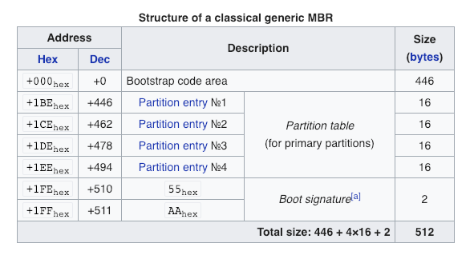
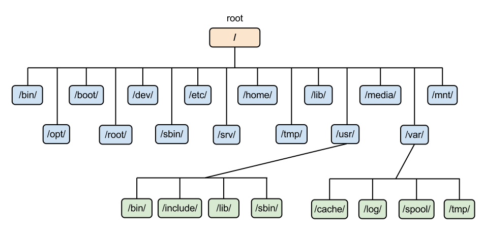

### How Your Computer Starts
Every computer follows a standard boot sequence when it starts up.

#### BIOS (Basic Input Output System)
The CPU runs an instruction in memory for the BIOS. This is a Jump instruction that transfers the Instruction Pointer to the code of the BIOS start-up program.  
The BIOS runs the Power On Self Test. It is a process performed by firmware or software routines immediately after a computer or any digital device is powered on. 
The POST performs the following checks & tasks: 

 - verify CPU registers
 - verify the integrity of the BIOS code itself
 - verify some basic components like DMA, timer, interrupt controller
 - find, size, and verify system main memory
initialize BIOS
 - pass control to other specialized extension BIOSes (if installed)
 - identify, organize, and select which devices are available for booting
 - discover, initialize, and catalog all system buses and devices
 - provide a user interface for system's configuration
 - construct whatever system environment is required by the target operating system

Every hardware manufacturer has its own BIOS code hardcoded on the ROM. 
The BIOS has a boot sequence configured which searches for the boot devices sequentially. 
Booting devices can be of several types:

1.CD Drives

2.Hard Disk Drives

3.USB Drives

4.Network

As soon as it finds the boot device, it looks for the Master Boot Record. The MBR has number of partitions in it. If any active partition is found it is loaded into memory.


##### Master Boot Record
It is a special type of boot sector at the beginning of data drives. It holds information about the logical partitions,organisation of the file systems and also a boot loader. The boot loader is responsible to load the kernel(A subset of the entire OS) into memory.
It may happen that the selected memory drive has multiple operating systems. The bootloader allows selection of the OS(Along with different kernels)to be loaded. GRUB is an open source bootloader by GNU prominently seen on most Linux Distributions. 



#### Kernel

As soon as the kernel is loaded into memory by the boot loader, the Kernel mounts Linux/Unix Virtual file system. 
The Linux Virtual File System is of the format shown below:



#### Init (Now Systemd For Linux)

The Kernel executes the /sbin/init binary. Init is the first program executed by the Kernel in Kernel Space. It is given the process Id (PID) of 1.
However in the recent versions init is replaced by a System Management Daemon called systemd. Systemd was designed to overcome the shortcomings of Initd. It is the parent process of all the processes.

You can find the source code of Systemd [here](https://github.com/systemd/systemd).

There are six different run levels in Linux. (Used with Initd)

* 0 – halt
* 1 – Single user mode
* 2 – Multiuser, without NFS
* 3 – Full multiuser mode
* 4 – unused
* 5 – X11 (X Window System)
* 6 – reboot

Each runlevel has its own set of programs which can be seen in - 

```
Run level 0 – /etc/rc.d/rc0.d/
Run level 1 – /etc/rc.d/rc1.d/
Run level 2 – /etc/rc.d/rc2.d/
Run level 3 – /etc/rc.d/rc3.d/
Run level 4 – /etc/rc.d/rc4.d/
Run level 5 – /etc/rc.d/rc5.d/
Run level 6 – /etc/rc.d/rc6.d/
```

Each of these directories have programs starting with S (Used during startup) and K(Used during shutdown)

