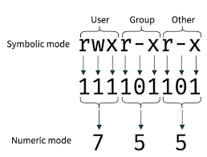

### Things to know about Linux 


An operating system is divided into three parts:

1. The Kernel 
2. Shell 
3. User Applications 

The kernel interfaces directly with the hardware. The kernel also has a sub layer within it which is architecture dependent.

Several shells have been introduced with Bash being the most popular amongst them.

User applications interact with the hardware with system calls. System calls were introduced to provide security and abstraction while accessing.

The diagram given below explains the layout: 


### Important Linux Commands 

Linux commands are a result of binary executables which are usually stored in your /bin,/usr/bin or /sbin folders. Commands can also be made from interpreter scripts like bash,Python,Perl etc.

```
which ls
```
The which command shows the location of the binary executable of ls.

What is the $PATH environment variable? 


Every Linux & Unix System has several environment variables which are dynamic variables essential for running several processes in the system.
$HOME,$env being some of the well known environment variables.

The $PATH environment variable stores all the paths where one can find the binary executables for all the commands that we use.

Whenever a command is invoked from the terminal,all the paths in the $PATH environment variable are looked up and if the binary is found, the command is executed.

Trying this out on the terminal produces: 
```
echo $PATH

/home/linus/bin:/usr/local/sbin:/usr/local/bin:/usr/sbin:/usr/bin:/sbin:/bin

```
The path variable can be usually edited or updated from the .bash_profile hidden file(On Unix like OS) or directly by exporting the variable with the export command.


Creating your own command recipies

Linux or Unix commands can be usually built by shell scripts, Python or Perl scripts.
Let us create a simple Bash script that calculates the factorial of the number sent to it as an argument in the command.

```
#!/bin/bash
count=$1 
fact=1
while [ $count -gt 0 ] 
do
   fact=$(( $fact * $count ))
   count=$(( $count - 1 ))
done
echo $fact

```

Create a sample file with a  .sh extension and copy the factorial code as given above.
Add the directory which contains the given file to your $PATH variable. Edit the variable from your .bash_profile or .profile located in your root directory with your preferred text editor.


```
nano ~/.bash_profle

```

The file may contain several other aliases and variables but look out for the lines and update as shown below
(Make sure there are no spacings between PATH and =)
```
export PATH=/home/linus/bin:/usr/local/sbin:/usr/local/bin:/usr/sbin:/usr/bin:/sbin:/bin:/directory_of_bash_script

```

Do not forget to source the .bash_profile or .profile file with the source command or . 

```
source .bash_profile
```
OR

```
. .bash_profile
```

Calling the script file name from the terminal with any number as the argument to the command will print the factorial to stdout.
The same thing can also be done by creating a symbolic link which will be discussed later.

### Dot Files

The beauty of Unix-like and Linux based systems is complete control & customisation of the system. 

Dot files are conventionally hidden files in Unix and Linux based systems which cannot be viewed neither from a regular file manager unless specified or by invoking ls.

However ls has a special flag -a which lists all the files in the directory. -l is also used with a to show the file permissions,size & modification information.

``` 
ls -a

``` 

If you list the hidden files in your root directory ('/') several well known dot files will be listed like the .bash_profile,.ssh folder etc.

Check out [here](https://dotfiles.github.io/) to get some really heavy customised dot files. Just clone the ones you like and replace the given dot files with your existing one or simply compile the code with make if a Makefile exists.


### File Permissions 

Unix & Linux provides Read(r),Write(w) and Execute(x) permissions to any file on the system. 
If you ``` ls -l ``` every file with its permissions will be shown.

The system is divided into three types - User,Group and others. The r,w,x permissions are assigned to each type. This is well explained by the diagram shown below: 


- Owner permissions − The owner's permissions determine what actions the owner of the file can perform on the file.

- Group permissions − The group's permissions determine what actions a user, who is a member of the group that a file belongs to, can perform on the file.

- Other (world) permissions − The permissions for others indicate what action all other users can perform on the file.

The chmod command helps to assign permissions or remove existing permissions. Permissions can be assigned in two ways - 

1.By using the letters r,w,x & a,o,u with the symbols +, - & =.
2. Using octal numbers.

Let us create a sample file and apply some root privileges to it.

Enter into root by typing ```su``` and entering the root password. 

``` echo "Test File " >> only_root.txt ```

Check the default permissions for the file by typing ``` ls -l only_root.txt ```. This produced: 

``` 
-rw-r--r--  1 linus staff 0 Jan 1 08:28 only_root.txt
```

We will be adding readonly permissions to this file. 
``` chmod a-w only_root.txt ```

Let us split the command. 
chmod - Used to assign permissions

a-w - a indicates 'all' minus is remove and w is write. So it is the shorthand notation for remove write permissions from all. Similarly to add a permission we can use the plus symbol.

only_root.txt - Is the file

Some examples of this shorthand notation:

* a+rwx - Add read,write and execute permissions to all
* u=x - Assign execute permission to the current user.
* o-wx - Remove write-execute permissions from other users.
* g+rw - Add read-write permissions to the group that the user belongs to.

The other mentioned way was is the octal number system. Check out the table given below:


The chmod command also accepts this method to assign permissions. 
Some examples are illustrated below:

The very popluar permission set that is seen is 

``` chmod 755 only_root.txt ``` 

Let us break it into parts

7 - Read,write & Execute permissions to the user
5 - Read & Execute permission to the group of the user

The way to remember this number system is referring to the binary equivalent of the octal number.



A set bit indicates that the permission exists and a clear bit indicates that it is removed.


