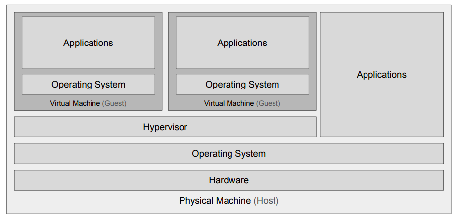
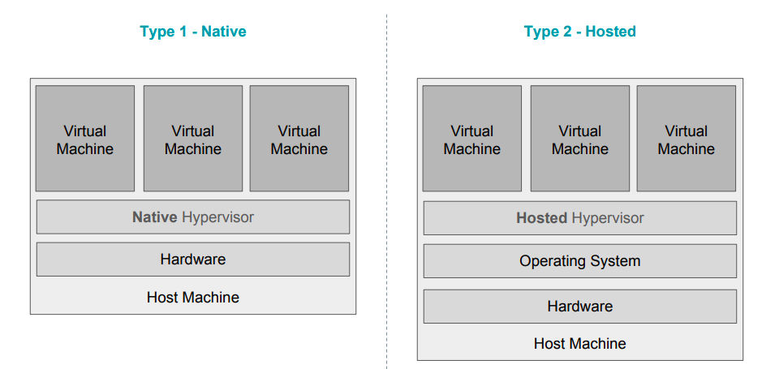

### Virtualisation in Operating Systems 

Virtualisation is the process of creating a virtual version of a physical object. 

Virtualisation is of three types primarily: 

1. Hardware Virtualisation - Based on simulating real hardware. This can be used to run a complete operating system. This can be further subdivided into full and paravirtualisation.

2. Desktop Virtualisation - It is the concept of separating the logical desktop from the physical machine. 

3. Operating system level virtualisation (also called as containerisation) - It is the operating system feature in which the kernel allows the existence of multiple isolated user-space instances. Such instances are called containers. Containerisation was introduced as a Linux Kernel feature in 2010. It started gaining momentum with the introduction of Docker. 

#### Hardware Virtualisation 

Some terminologies associated with Virtualisation:

1. Virtual Machine: It is a virtual representation of a physical machine.

2. Hypervisor: It is a software that manages and monitors running virtual machines.

3. Host machine: The physical machine that a virtual machine is running on.

4. Guest machine: The virtual machine running on the host machine. 

The following block diagram shows the position of each component mentioned above:

#### Hypervisors 

There are two main types of hypervisors:

1. Native: They run directly on the host machine and share out resources between guest machines. 

2. Hosted: They run as an application inside the operating system and support virtual machines running as individual processes.
Eg. VirutalBox,Parallel Desktop

